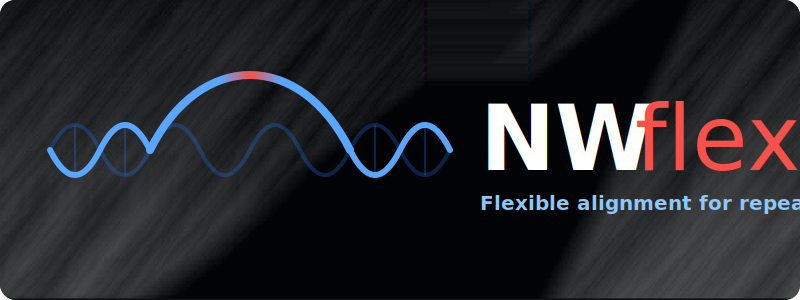

# NW-flex


**Flexible alignment for complicated references**

NW-flex is a sequence alignment library designed for short
tandem repeats (STRs) and other complex regions. 

The algorithm extends classical Needleman-Wunsch/Gotoh alignment by
introducing a contraction operation. 
Where semi-global alignment permits
unpenalized overhangs at sequence ends, NW-flex extends this
behavior to designated internal blocks. 

Given an STR locus model that spans a range of repeat counts, 
NW-flex aligns reads without assuming a fixed number of repeats,
finding an optimal alignment over all candidate repeat lengths
in a single pass.

> **Preprint**: link coming soon

## Key Features

- **Provably optimal alignments**: finds the best-scoring alignment over all
allowed contractions (no heuristics.)
- **Preset workflows**: ready-to-use entry points for common flex models:
    - Single-block contraction
    - STR phase-aware alignment
    - Multi-block/compound loci
- **Standard alignment modes**: global and semi-global variants supported.
- **Visualization tools**: plots and inspectors for alignments, DP state, and contractions.
- **Optional Cython acceleration**: a drop-in fast core for performance-critical use cases.
- **Educational notebooks**: derivations and interactive experiments.    


## Installation
**Requires Python 3.11 or later.**
```bash
# Create and activate conda environment
conda create --name nwflex python=3.11
conda activate nwflex

# Clone and install
git clone https://github.com/nwflex/nwflex.git
cd nwflex
pip install -e .
```

The installation will also compile the Cython extension automatically, which requires a C compiler (e.g. `gcc`, `clang`, or `MSVC`).
The only default python dependency is `numpy`.
For additional functionality, see use the [Optional Dependencies](#optional-dependencies) described below.

## "Hello World."
```python
from nwflex import get_default_scoring, align_standard, align_single_block

score_matrix, gap_open, gap_extend, a2i = get_default_scoring()
nw_result  = align_standard    ("ACGT", "AGT",       score_matrix, gap_open, gap_extend, a2i)
nwf_result = align_single_block("ACGT", "AGT", 1, 4, score_matrix, gap_open, gap_extend, a2i)

print("Standard NW:")
print(f"Score: {nw_result.score}")   # -5.0
print(f"X_aln: {nw_result.X_aln}")   # ACGT
print(f"Y_aln: {nw_result.Y_aln}")   # A-GT

print("\nSingle-block NW-flex:")
print(f"Score: {nwf_result.score}")   # 15.0
print(f"X_aln: {nwf_result.X_aln}")   # AGT
print(f"Y_aln: {nwf_result.Y_aln}")   # AGT
print(f"Jumps: {nwf_result.jumps}")   # [RowJump(from_row=1, to_row=3, col=2, state=1)]
```
**Expected output:**
```
Standard NW:
Score: -5.0
X_aln: ACGT
Y_aln: A-GT

Single-block NW-flex:
Score: 15.0
X_aln: AGT
Y_aln: AGT
Jumps: [RowJump(from_row=1, to_row=3, col=2, state=1)]
```

## Common workflows

### Aligning reads to an STR locus
The most common use case is aligning reads to a reference sequence
that contains a short tandem repeat (STR) region. We assume the region has a left flank `A`, repeat region `Z`, and right flank `B`, so that the full reference is `X = A · Z · B`.
The repeat region `Z` consists of `N` copies of a motif `R`, i.e. `Z = R^N` where we choose `N` to be large enough to cover all expected repeat counts in reads.

```python
import nwflex as nw

# 1. Define the STR locus structure
locus = nw.STRLocus(
    A="ATCGATCG", # Left flank (8 bp)
    R="CAG",      # Repeat motif (3 bp)
    N=10,         # Reference repeat count (extra-roomy)
    B="GTCAGTCA", # Right flank (8 bp)
)
# 2. Use default scoring model (match=5.0)
score_matrix, gap_open, gap_extend, a2i = nw.get_default_scoring()

# 3. Create a simulated read with fewer repeats (e.g., 6 copies instead of 10)
Y = locus.build_locus_variant(a=0, b=0, M=3)  # A  + (R * 6) + B

# 4. Align the read using STR-aware NW-flex
#    free_X and free_Y true for semiglobal
result = nw.align_STR_block(
    strLocus=locus,
    Y=Y,
    score_matrix=score_matrix,
    gap_open=gap_open,
    gap_extend=gap_extend,
    alphabet_to_index=a2i,
    free_X=True,
    free_Y=True
)

# alignment over best substring:
print("\nContracted alignment")
print(result.X_aln, result.Y_aln, sep="\n")

# expand to show full alignment
X_full, Y_full = result.expanded_alignment(locus.X, Y)
a, b, M = locus.jumps_to_phase(result.jumps)

print("\nExpanded alignment")
print(X_full, Y_full, sep="\n")
print(f"\nAligned to repeat phase: (a={a}, b={b}, M={M})")
print(f"Alignment score        : {result.score}")
print(f"Perfect alignment      : {len(Y)*5.0}")
```

### Optional Dependencies

```bash
# For plotting (matplotlib, seaborn)
pip install -e .[plot]

# For development/testing
pip install -e .[dev]

# For running notebooks
pip install -e .[notebooks]

# Everything
pip install -e .[all]
```

## Terminology

**NW-flex** uses the following notation throughout the codebase and documentation, reflecting the formalism in the preprint:

### Reference Model: X = A · Z · B

| Symbol | Meaning | Example |
|--------|---------|---------|
| **X** | Full reference sequence            | `"ACGTATATGCTAC"` |
| **A** | Left flank (fixed prefix)          | `"ACGT"` |
| **Z** | Flexible interior block            | `"ATAT"` |
| **B** | Right flank (fixed suffix)         | `"GCTAC"` |
| **s** | Start index of Z in X (= len(A))   | `4` |
| **e** | End index of Z in X (= s + len(Z)) | `8` |

### STR Model: Z = R^N

| Symbol | Meaning | Example |
|--------|---------|---------|
| **R** | Repeat motif (unit sequence) | `"AT"` |
| **N** | Number of repeats in reference | `4` (so Z = "ATATATAT") |
| **k** | Motif length (= len(R)) | `2` |
| **M** | Number of repeats in read variant | `2` (so Z* = "ATAT") |

### Alignment

| Symbol | Meaning |
|--------|---------|
| **Y** | Read sequence to align against X |
| **Z*** | Contracted version of Z in alignment |
| **Jump** | A skip over part of Z during alignment |
| **EP** | Extra predecessors, E(i) is the set of allowed jumps to row i |

## Documentation

### Supplementary Notebooks
The `notebooks/` directory contains a pedagogical series explaining NW-flex from first principles:

| Notebook | Description |
|----------|-------------|
| `01_Alignment_Basics.ipynb` | Introduction to pairwise alignment and DAG representation |
| `02_NWflex_Core.ipynb` | The Extra Predecessor framework and core algorithm |
| `03_NWflex_Validation.ipynb` | Correctness validation against baseline implementations |
| `04_NWflex_STR.ipynb` | Application to Short Tandem Repeat alignment |
| `05_NWflex_Cython.ipynb` | Cython acceleration and performance |
| `06_NWflex_STR_locus.ipynb` | Simulating reads from STR loci and phase-aware alignment |

A merged PDF can generated with the command 
```bash
cd notebooks && ./build_pdf.sh
```

### Module Reference

| Module | Purpose |
|--------|---------|
| `aligners.py` | User-facing alignment functions (`align_standard`, `align_single_block`, `align_STR_block`, etc.) |
| `dp_core.py` | Three-state Gotoh DP with row-wise extra predecessors. Core dataclasses: `FlexInput`, `FlexData`, `RowJump`, `AlignmentResult` |
| `ep_patterns.py` | EP configuration builders: `build_EP_standard`, `build_EP_single_block`, `build_EP_STR_phase` |
| `fast.py` | Cython-accelerated DP via `run_flex_dp_fast()` |
| `repeats.py` | STR utilities: `phase_repeat`, `STRLocus`, `CompoundSTRLocus` |
| `validation.py` | Baseline implementations for testing: `nwg_global`, `sflex_naive` |

## Testing

```bash
# Run all tests
pytest tests/ -v

# Run with coverage
pytest tests/ --cov=nwflex --cov-report=term-missing
```

See `tests/README.md` for detailed test documentation.

## Algorithm Overview

NW-flex modifies the standard Gotoh three-state recurrence by allowing additional predecessor rows beyond the baseline `i-1`:

```
Standard:  M[i,j] depends on M[i-1, j-1], Xg[i-1, j-1], Yg[i-1, j-1]
NW-flex:   M[i,j] depends on {i-1} ∪ E(i) predecessor rows
```

Where `E(i)` is the **extra predecessor set** for row `i`. This enables:

- **Single-block flex**: Skip over a designated block region
- **STR phase alignment**: Skip repeat units while maintaining phase consistency
- **Multi-STR**: Handle compound loci with multiple repeat blocks

The traceback records which predecessor was used, allowing reconstruction of the alignment path including any "jumps" over repeat regions.

## Project Structure

```
nwflex/
├── nwflex/            # Package source
│   ├── aligners.py    # User-facing API
│   ├── dp_core.py     # Core DP algorithm
│   ├── ep_patterns.py # EP configuration builders
│   ├── fast.py        # Cython interface
│   ├── repeats.py     # STR utilities
│   ├── plot/          # Visualization subpackage
│   └── _cython/       # Cython source
├── notebooks/         # Educational notebooks
├── scripts/           # Figure generation scripts
└── tests/             # pytest test suite
```

## Citation

*[Citation information will be added upon publication]*

## License

MIT License. See [LICENSE](LICENSE) for details.
